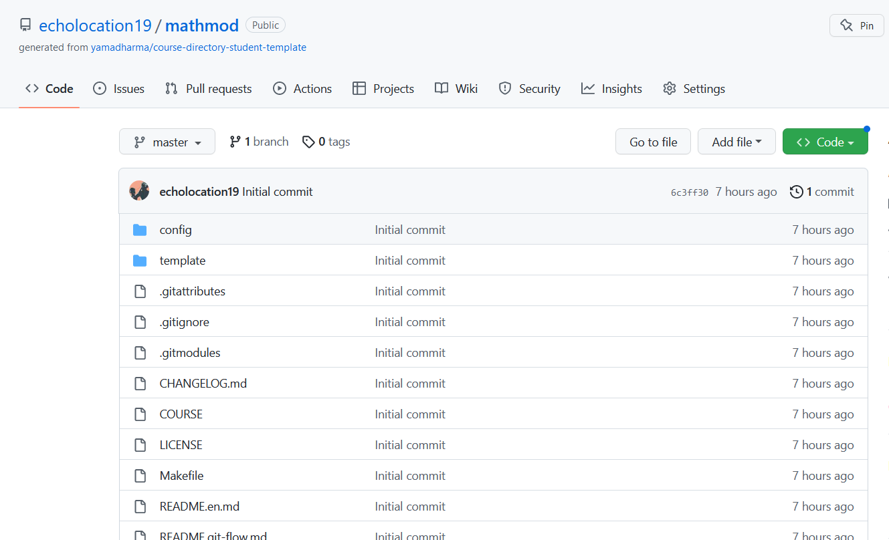
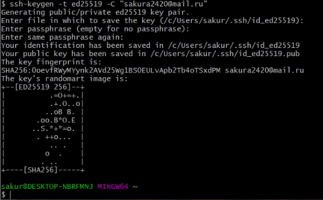
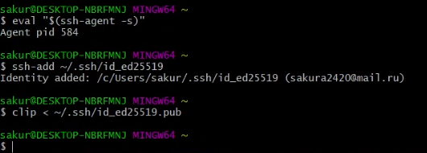
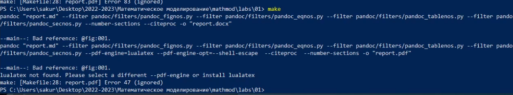
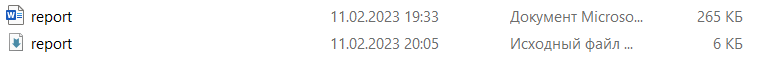

---
## Front matter
lang: ru-RU
title: Структура научной презентации
subtitle: Простейший шаблон
author:
  - Кулябов Д. С.
institute:
  - Российский университет дружбы народов, Москва, Россия
  - Объединённый институт ядерных исследований, Дубна, Россия
date: 01 января 1970

## i18n babel
babel-lang: russian
babel-otherlangs: english

## Formatting pdf
toc: false
toc-title: Содержание
slide_level: 2
aspectratio: 169
section-titles: true
theme: metropolis
header-includes:
 - \metroset{progressbar=frametitle,sectionpage=progressbar,numbering=fraction}
 - '\makeatletter'
 - '\beamer@ignorenonframefalse'
 - '\makeatother'
---

# Информация

## Докладчик

:::::::::::::: {.columns align=center}
::: {.column width="70%"}

  * Краснова Диана Владимировна
  * Студ билет 1032201743
  * Российский университет дружбы народов

:::
::: {.column width="30%"}

:::
::::::::::::::

::: incremental

## Цели и задачи

-	Познакомиться с основными возможностями разметки Markdown.
-	Настроить ssh ключ для гитхаба

:::

::: incremental

## Материалы и методы

- официальная документация Markdown
- официальная документация Github

:::

## Установка пакетов

::: incremental

Установить необходимые пакеты для работы: pandocm teX Live, python3, choco

:::

# Сохранение темплейта

::: incremental

Сохранить template репозитория к себе на гитхаб

{ width=70% }

:::

# Клонирование репозитория

::: incremental

Для клонирования репозитория создаем ssh key, выполняем команду ssh-keygen

{ width=70% }
{ width=70% }

:::

# Выполнение команды make

::: incremental

Выполняем команду

{ width=70% }
{ width=70% }

:::

## Результаты

::: incremental

Я освежила знания по работе с разметкой Markdown и сделала подготовительные действия для дальнейшей работы с репозиторием предмета

:::

