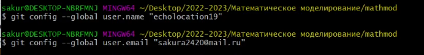

---
## Front matter
title: "Лабораторная работа №1"
subtitle: "Настройка проекта"
author: "Краснова Диана Владимировна"

## Generic otions
lang: ru-RU
toc-title: "Содержание"

## Bibliography
bibliography: bib/cite.bib
csl: pandoc/csl/gost-r-7-0-5-2008-numeric.csl

## Pdf output format
toc: true # Table of contents
toc-depth: 2
lof: true # List of figures
lot: true # List of tables
fontsize: 12pt
linestretch: 1.5
papersize: a4
documentclass: scrreprt
## I18n polyglossia
polyglossia-lang:
  name: russian
  options:
	- spelling=modern
	- babelshorthands=true
polyglossia-otherlangs:
  name: english
## I18n babel
babel-lang: russian
babel-otherlangs: english
## Fonts
mainfont: PT Serif
romanfont: PT Serif
sansfont: PT Sans
monofont: PT Mono
mainfontoptions: Ligatures=TeX
romanfontoptions: Ligatures=TeX
sansfontoptions: Ligatures=TeX,Scale=MatchLowercase
monofontoptions: Scale=MatchLowercase,Scale=0.9
## Biblatex
biblatex: true
biblio-style: "gost-numeric"
biblatexoptions:
  - parentracker=true
  - backend=biber
  - hyperref=auto
  - language=auto
  - autolang=other*
  - citestyle=gost-numeric
## Pandoc-crossref LaTeX customization
figureTitle: "Рис."
tableTitle: "Таблица"
listingTitle: "Листинг"
lofTitle: "Список иллюстраций"
lotTitle: "Список таблиц"
lolTitle: "Листинги"
## Misc options
indent: true
header-includes:
  - \usepackage{indentfirst}
  - \usepackage{float} # keep figures where there are in the text
  - \floatplacement{figure}{H} # keep figures where there are in the text
---

# Цель работы

- Познакомиться с основными возможностями разметки Markdown.
- Настроить ssh ключ для гитхаба
- Сделать подготовительные действия для дальнейшей работы с репозиторием

# Задание

Сделать подготовительные действия по выгрузке репозитория на гитхаб для дальнейшей работы с репозиторием, написать отчет по выполненной работе

# Теоретическое введение

| Команда  | Описание команды                                                                                                         |
|---------------|----------------------------------------------------------------------------------------------------------------------------|
| `ssh-keygen`          | Генерация ssh ключа                                                                               |
| `git clone `      | Клонирование репозитория     |
| `clip`       | Копирование в буфер обмена                                        |
| `make`      | Выполнение make файла |

# Выполнение лабораторной работы

0. Предварительно устанавливаем необходимые пакеты для работы: pandoc, texlive, 

1. Копируем template из гитхаба преподавателя

{ #fig:1 width=70% }

2. Создаем папку проекта вида 2022-2023/Математическое моделирование и переходим в нее
{ width=70% }

3. Для клонирования репозитория создаем ssh key, выполняем команду ssh-keygen

{ width=70% }

4. Добавляем и копируем получившийся ключ, заносим его в гитхаб через веб версию

{ width=70% }

5. Устанавливаем данные пользователя через get config с параметром global (рис. \ref{screen_5})

{ width=70% }

6. Клонируем проект с помощью команды git clone, с параметром recursive через только созданный ssh

{ width=70% }

7. Удаляем package.json

{ width=70% }

8. С помощью make формируем docx файл

{ width=70% }

9. В результате получаем docx файл с репортом

{ width=70% }

# Выводы

Я освежила знания по работе с разметкой Markdown и сделала подготовительные действия для дальнейшей работы с репозиторием предмета

# Список литературы{.unnumbered}

- https://docs.github.com/en/authentication/connecting-to-github-with-ssh/generating-a-new-ssh-key-and-adding-it-to-the-ssh-agent
- https://www.markdownguide.org/