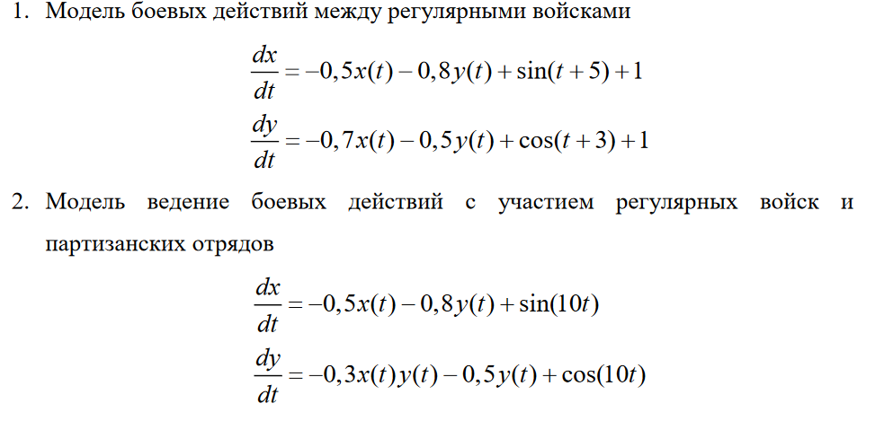
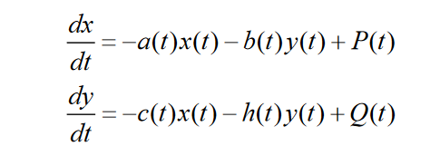
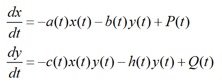
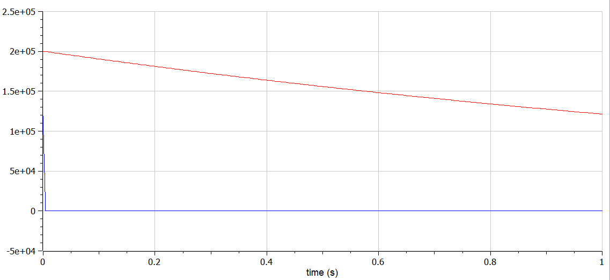
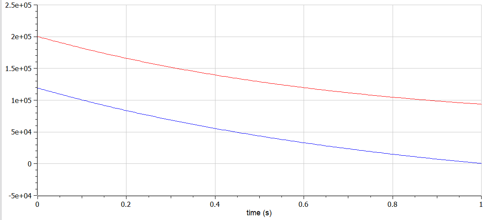
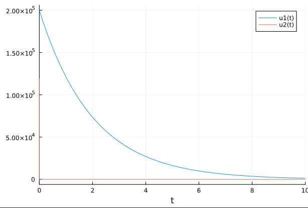
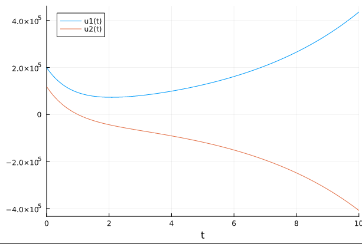

---
## Front matter
title: "Лабораторная работа №1"
author: "Краснова Диана Владимировна"

## Generic otions
lang: ru-RU
toc-title: "Содержание"

## Bibliography
bibliography: bib/cite.bib
csl: pandoc/csl/gost-r-7-0-5-2008-numeric.csl

## Pdf output format
toc: true # Table of contents
toc-depth: 2
lof: true # List of figures
lot: true # List of tables
fontsize: 12pt
linestretch: 1.5
papersize: a4
documentclass: scrreprt
## I18n polyglossia
polyglossia-lang:
  name: russian
  options:
	- spelling=modern
	- babelshorthands=true
polyglossia-otherlangs:
  name: english
## I18n babel
babel-lang: russian
babel-otherlangs: english
## Fonts
mainfont: PT Serif
romanfont: PT Serif
sansfont: PT Sans
monofont: PT Mono
mainfontoptions: Ligatures=TeX
romanfontoptions: Ligatures=TeX
sansfontoptions: Ligatures=TeX,Scale=MatchLowercase
monofontoptions: Scale=MatchLowercase,Scale=0.9
## Biblatex
biblatex: true
biblio-style: "gost-numeric"
biblatexoptions:
  - parentracker=true
  - backend=biber
  - hyperref=auto
  - language=auto
  - autolang=other*
  - citestyle=gost-numeric
## Pandoc-crossref LaTeX customization
figureTitle: "Рис."
tableTitle: "Таблица"
listingTitle: "Листинг"
lofTitle: "Список иллюстраций"
lotTitle: "Список таблиц"
lolTitle: "Листинги"
## Misc options
indent: true
header-includes:
  - \usepackage{indentfirst}
  - \usepackage{float} # keep figures where there are in the text
  - \floatplacement{figure}{H} # keep figures where there are in the text
---

# Цель
Выполнения задания по построению модели Ланчестера 

# Задание

Между страной Х и страной У идет война. Численность состава войск
исчисляется от начала войны, и являются временными функциями x(t) и y(t). В начальный момент времени страна Х имеет армию численностью 200 000 человек,
а в распоряжении страны У армия численностью в 119 000 человек. Для упрощения
модели считаем, что коэффициенты, a b c h постоянны. Также считаем P(t) и Q(t) непрерывные функции.
Постройте графики изменения численности войск армии Х и армии У для следующих случаев (рис. @fig:001).

{#fig:001 width=70%}


# Теоретическое введение

*Законы Ланчестера (законы Осипова — Ланчестера)* — математическая формула для расчета относительных сил пары сражающихся сторон — подразделений вооруженных сил                                                   

# Выполнение лабораторной работы

1. Предварительно скачать OpenModelica и ознакомиться с интерфейсом 

2. Рассотрим первую модель боевых действий между регулярными войсками в OpenModelica.
В случае с боевыми действиями между регулярными войсками численность регулярных войск определяется тремя
факторами:
- скорость уменьшения численности войск из-за причин, не связанных с
боевыми действиями (болезни, травмы, дезертирство);
- скорость потерь, обусловленных боевыми действиями
противоборствующих сторон (что связанно с качеством стратегии,
уровнем вооружения, профессионализмом солдат и т.п.);
- скорость поступления подкрепления (задаётся некоторой функцией от времени). 
В этом случае модель боевых действий между регулярными войсками описывается следующим образом (рис. @fig:002)

{#fig:002 width=70%}

Потери, не связанные с боевыми действиями, описывают члены -a(t)x(t) и -h(t)y(t), члены -b(t)y(t) и -c(t)x(t) отражают потери на поле боя. Коэффициенты b(t) и c(t) указывают на эффективность боевых действий со
стороны у и х соответственно,a(t), h(t) - величины, характеризующие степень влияния различных факторов на потери. Функции P(t), Q(t) учитывают возможность подхода подкрепления к войскам Х и У в течение одного дня

```
model MyModel
  parameter Real a(start=0.5);
  parameter Real b(start=0.8);
  parameter Real c(start=0.7);
  parameter Real h(start=0.5);
  Real y1(start=200000);
  Real y2(start=119000);

 equation
  der(y1)= -a*y1-b*y2 + sin(time+5)+1;
  der(y2)= -c*y1-h*y2 + cos(time+3)+1;
 annotation(experiment(StartTime = 0, StopTime = 1, Tolerance = 1e-6, Interval = 0.005));
end MyModel;
```

3. Рассотрим вторую модель боевых действий с участием регулярных войск и партизанских отрядов в OpenModelica.
Нерегулярные
войска в отличии от постоянной армии менее уязвимы, так как действуют скрытно,
в этом случае сопернику приходится действовать неизбирательно, по площадям,
занимаемым партизанами. Поэтому считается, что тем потерь партизан,
проводящих свои операции в разных местах на некоторой известной территории,
пропорционален не только численности армейских соединений, но и численности
самих партизан. В результате модель принимает вид (рис. @fig:003)

{#fig:003 width=70%}

В этой системе все величины имеют тот же смысл, что и в системе 1

```
model MyModel2
  parameter Real a(start=0.5);
  parameter Real b(start=0.8);
  parameter Real c(start=0.3);
  parameter Real h(start=0.5);
  Real y1(start=200000);
  Real y2(start=119000);

 equation
  der(y1)= -a*y1-b*y2 + sin(10*time);
  der(y2)= -c*y1*y2-h*y2 + cos(10*time);
 annotation(experiment(StartTime = 0, StopTime = 1, Tolerance = 1e-6, Interval = 0.005));
end MyModel2;
```

4. Рассотрим первую модель боевых действий между регулярными войсками и  модели регулярных войск и партизанских отрядов, воспользовавшись возможностями языка Julia
```
using DifferentialEquations
using Plots

const x = 200000.0
const y = 119000.0

function res1(du,u,p,t)
    du[1] = -0.5u[1]-0.8u[2]+sin(t+5)+1
    du[2] = -0.7u[1]-0.5u[2]+cos(t+3)+1
end

function res2(du,u,p,t)
    du[1] = -0.5u[1]-0.8u[2]+sin(10*t)
    du[2] = -0.3u[1]*u[2]-0.5u[2]+cos(10*t)
end

condition(u,t,integrator) = u[1]
cb = ContinuousCallback(condition,terminate!)
u0 = [x, y]
tspan = (0.0,10.0)
# case 1
prob = ODEProblem(res1,u0,tspan, callback = cb)
sol = solve(prob)
plt1 = plot(sol)

# case 2
prob2 = ODEProblem(res2,u0,tspan, callback = cb)
sol2 = solve(prob2)
plt2 = plot(sol2)
```

В результате получаем следующие графики
Openmodelica случай 2 (рис. @fig:004)
{#fig:004 width=70%}
Openmodelica случай 1 (рис. @fig:005)
{#fig:005 width=70%}
Julia случай 2 (рис. @fig:006)
{#fig:006 width=70%}
Julia случай 1 (рис. @fig:007)
{#fig:007 width=70%}

# Выводы

Я выполнила задание по построению модели Ланчестера