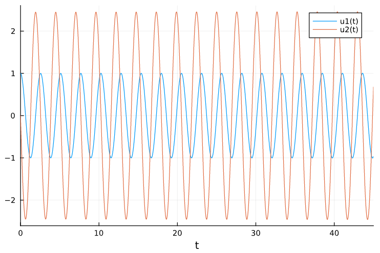

---
## Front matter
lang: ru-RU
title: Структура научной презентации
subtitle: Простейший шаблон
author:
  - Краснова Д.В
institute:
  - Российский университет дружбы народов, Москва, Россия
  - Объединённый институт ядерных исследований, Дубна, Россия
date: 01 января 1970

## i18n babel
babel-lang: russian
babel-otherlangs: english

## Formatting pdf
toc: false
toc-title: Содержание
slide_level: 2
aspectratio: 169
section-titles: true
theme: metropolis
header-includes:
 - \metroset{progressbar=frametitle,sectionpage=progressbar,numbering=fraction}
 - '\makeatletter'
 - '\beamer@ignorenonframefalse'
 - '\makeatother'
---

# Цель работы

Рассмотреть модель гармонических колебаний

## Задача

Постройте фазовый портрет гармонического осциллятора и решение уравнения гармонического осциллятора для следующих случаев 

1. Колебания гармонического осциллятора без затуханий и без действий внешней
силы $\ddot{x}+6x=0$
2. Колебания гармонического осциллятора c затуханием и без действий внешней
силы $\ddot{x}+5\dot{x}+25x=0$
3. Колебания гармонического осциллятора c затуханием и под действием внешней
силы $\ddot{x}+3\dot{x}+4x\cos{3.5t}$

На итнтервале $t \in [ 0;45 ]$, шаг 0.05, $x_0=1, y_0=0$

## Выполнение работы

1. В системе отсутствуют потери энергии (колебания без затухания)
Получаем уравнение 
$$\ddot{x}+\omega_0^2x=0$$

Переходим к двум дифференциальным уравнениям первого порядка:
$$
 \begin{cases}
	\dot{x}=y
	\\   
	\dot{y}=-\omega_0^2x
 \end{cases}
$$

{ #fig:001 width=70% height=70% }

{ #fig:002 width=70% height=70% }

{ #fig:003 width=70% height=70% }

2.  В системе присутствуют потери энергии (колебания с затуханием)
Получаем уравнение 
$$\ddot{x}+2\gamma\dot{x}+\omega_0^2x=0$$

Переходим к двум дифференциальным уравнениям первого порядка:
$$
 \begin{cases}
	\dot{x}=y
	\\   
	\dot{y}=-2\gamma y-\omega_0^2x
 \end{cases}
$$

{ #fig:004 width=70% height=70% }

{ #fig:005 width=70% height=70% }

{ #fig:006 width=70% height=70% }

3. На систему действует внешняя сила.
Получаем уравнение 
$$\ddot{x}+2\gamma\dot{x}+\omega_0^2x=F(t)$$

Переходим к двум дифференциальным уравнениям первого порядка:
$$
 \begin{cases}
	\dot{x}=y
	\\   
	\dot{y}=F(t)-2\gamma y-\omega_0^2x
 \end{cases}
$$

{ #fig:007 width=70% height=70% }

{ #fig:008 width=70% height=70% }

{ #fig:009 width=70% height=70% }

# Выводы
Я рассмотрела и построила фазовые портреты гармонических колебаний без затухания, с затуханием и при действии внешней силы.