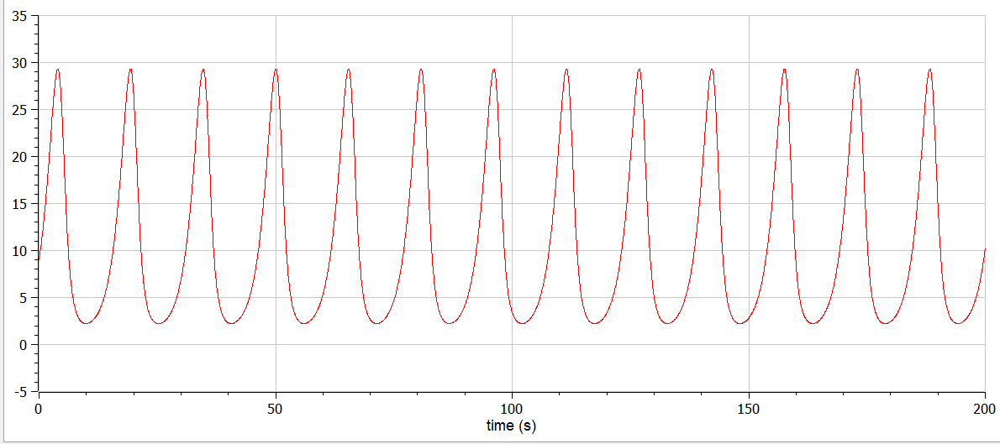
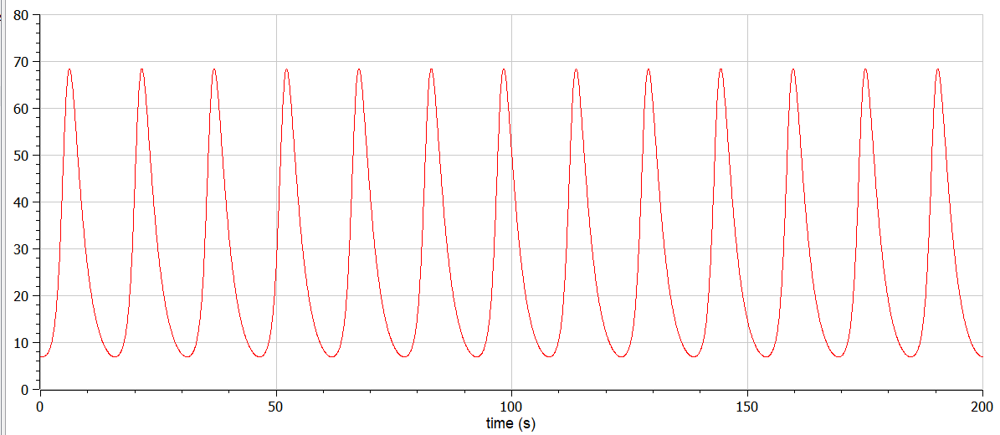
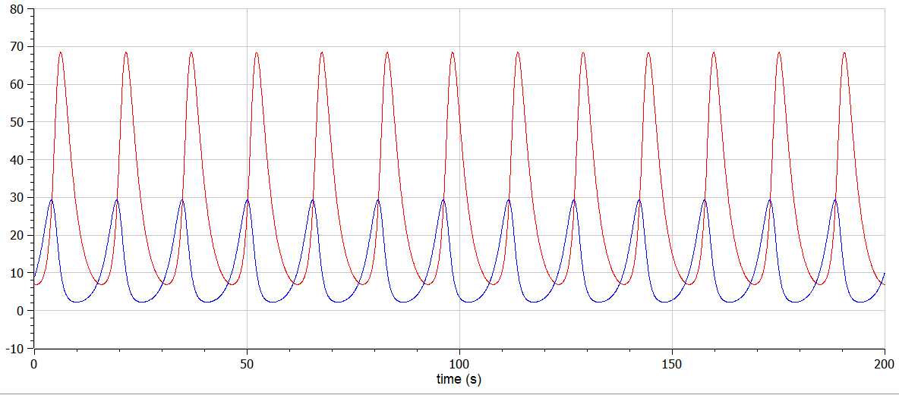
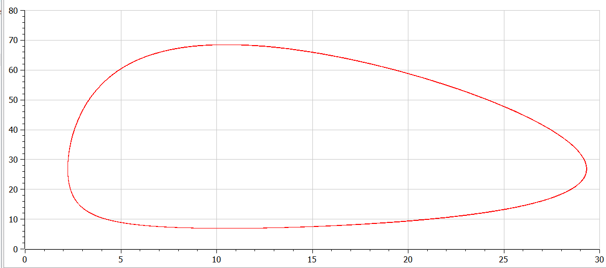
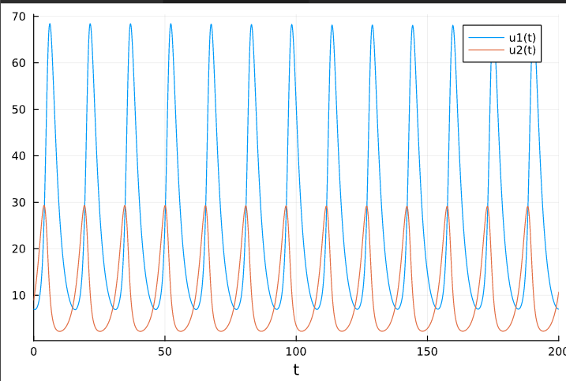

---
## Front matter
lang: ru-RU
title: Структура научной презентации
subtitle: Простейший шаблон
author:
  - Краснова Д.В
institute:
  - Российский университет дружбы народов, Москва, Россия
  - Объединённый институт ядерных исследований, Дубна, Россия
date: 01 января 1970

## i18n babel
babel-lang: russian
babel-otherlangs: english

## Formatting pdf
toc: false
toc-title: Содержание
slide_level: 2
aspectratio: 169
section-titles: true
theme: metropolis
header-includes:
 - \metroset{progressbar=frametitle,sectionpage=progressbar,numbering=fraction}
 - '\makeatletter'
 - '\beamer@ignorenonframefalse'
 - '\makeatother'
---

# Цель работы

Построить модель хищник-жертва и изучить теоритические данные по построению

# Задание

1.	Построить график зависимости $x$ от $y$ и графики функций $x(t)$, $y(t)$
2.	Найти стационарное состояние системы

## Ход работы
1. Построить модель в соответствии со следующей системой:

$$
 \begin{cases}
	\frac{dx}{dt} = -0.41x(t) + 0.039y(t)x(t)
	\\   
	\frac{dy}{dt} = 0.51y(t) - 0.019y(t)x(t)
 \end{cases}
$$

Построим график зависимости численности хищников от численности жертв, а также графики изменения численности хищников и численности жертв 
при следующих начальных условиях: $x_0=7, y_0=9$
Найдем стационарное состояние системы

2. Код в open modelica

{ #fig:001 width=70% height=70% }

{ #fig:002 width=70% height=70% }

{ #fig:003 width=70% height=70% }

{ #fig:004 width=70% height=70% }

Стационарное состояние $x_0=\frac{a}{b}=10.51, y_0=\frac{c}{d}=26.8$

2. Код в Julia

{ #fig:005 width=70% height=70% }

# Выводы

В ходе выполнения лабораторной работы я изучила модель хищник-жертва и построила необходимые графики