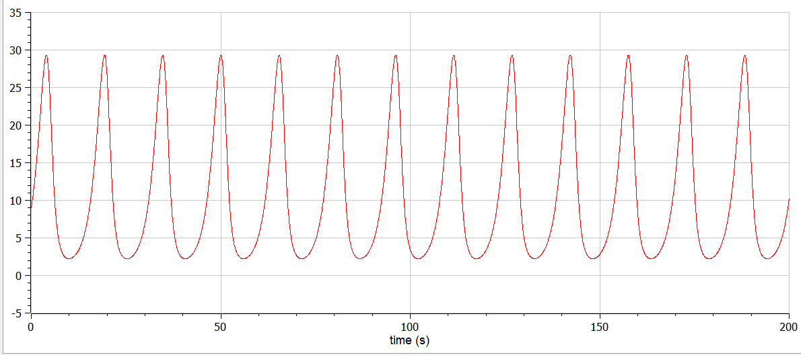
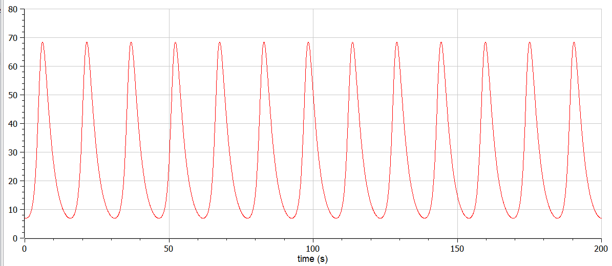
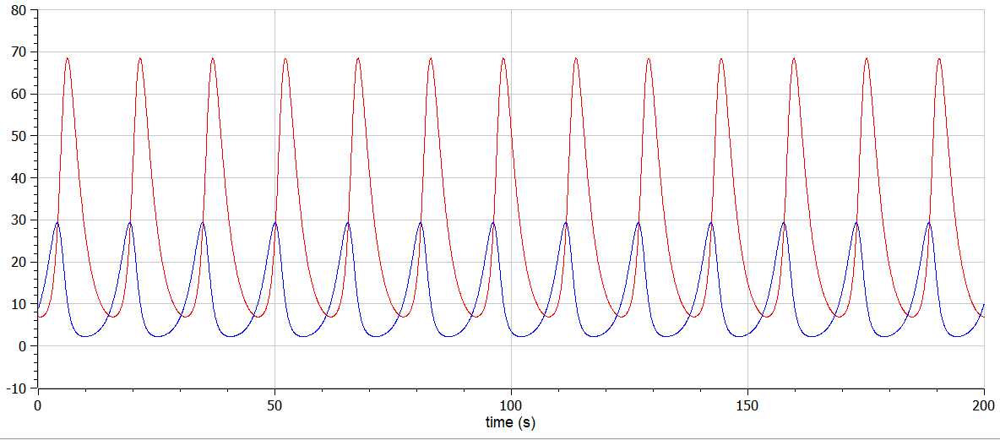
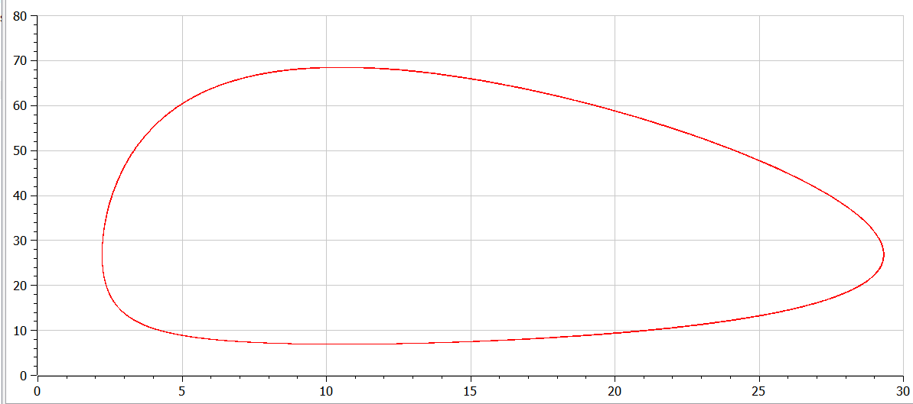
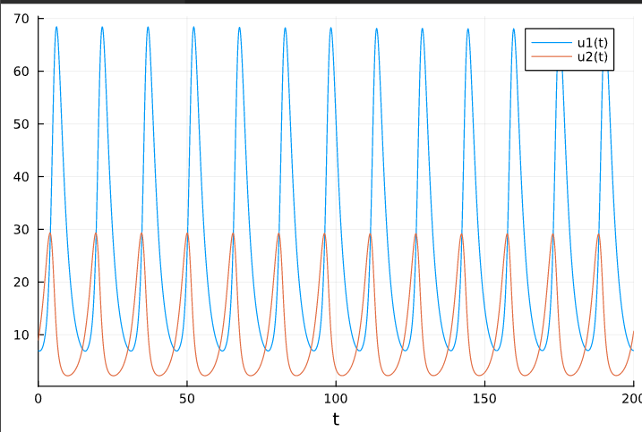

---
## Front matter
title: "Лабораторная работа №1"
author: "Краснова Диана Владимировна"

## Generic otions
lang: ru-RU
toc-title: "Содержание"

## Bibliography
bibliography: bib/cite.bib
csl: pandoc/csl/gost-r-7-0-5-2008-numeric.csl

## Pdf output format
toc: true # Table of contents
toc-depth: 2
lof: true # List of figures
lot: true # List of tables
fontsize: 12pt
linestretch: 1.5
papersize: a4
documentclass: scrreprt
## I18n polyglossia
polyglossia-lang:
  name: russian
  options:
	- spelling=modern
	- babelshorthands=true
polyglossia-otherlangs:
  name: english
## I18n babel
babel-lang: russian
babel-otherlangs: english
## Fonts
mainfont: PT Serif
romanfont: PT Serif
sansfont: PT Sans
monofont: PT Mono
mainfontoptions: Ligatures=TeX
romanfontoptions: Ligatures=TeX
sansfontoptions: Ligatures=TeX,Scale=MatchLowercase
monofontoptions: Scale=MatchLowercase,Scale=0.9
## Biblatex
biblatex: true
biblio-style: "gost-numeric"
biblatexoptions:
  - parentracker=true
  - backend=biber
  - hyperref=auto
  - language=auto
  - autolang=other*
  - citestyle=gost-numeric
## Pandoc-crossref LaTeX customization
figureTitle: "Рис."
tableTitle: "Таблица"
listingTitle: "Листинг"
lofTitle: "Список иллюстраций"
lotTitle: "Список таблиц"
lolTitle: "Листинги"
## Misc options
indent: true
header-includes:
  - \usepackage{indentfirst}
  - \usepackage{float} # keep figures where there are in the text
  - \floatplacement{figure}{H} # keep figures where there are in the text
---

# Цель работы

Построить модель хищник-жертва и изучить теоритические данные по построению

# Задание

1.	Построить график зависимости $x$ от $y$ и графики функций $x(t)$, $y(t)$
2.	Найти стационарное состояние системы


# Выполнение лабораторной работы

## Теоретические сведения

Дана матетиматическая модель системы «Хищник-жертва». 

Рассмотрим базисные компоненты системы. 
Пусть система имеет $X$ хищников и $Y$ жертв. Данная двувидовая модель основывается на следующих предположениях:
1.	Численность популяции жертв и хищников зависят только от времени (модель не учитывает пространственное распределение популяции на занимаемой территории) 
2.	В отсутствии взаимодействия численность видов изменяется по модели Мальтуса, при этом число жертв увеличивается, а число хищников падает 
3.	Естественная смертность жертвы и естественная рождаемость хищника считаются несущественными 
4.	Эффект насыщения численности обеих популяций не учитывается 
5.	Скорость роста численности жертв уменьшается пропорционально численности хищников:

$$
 \begin{cases}
	\frac{dx}{dt} = -ax(t) + by(t)x(t)
	\\   
	\frac{dy}{dt} = cy(t) - dy(t)x(t)
 \end{cases}
$$

Параметр $a$ определяет коэффициент смертности хищников, $b$ – коэффициент естественного прироста хищников, $c$ – коэффициент прироста жертв и $d$ – коэффициент смертности жертв

В зависимости от этих параметрах система и будет изменяться. Однако следует выделить одно важное состояние системы, при котором не происходит никаких изменений как со стороны хищников, так и со стороны жертв. Это, так называемое, стационарное состояние системы. При нем, как уже было отмечено, изменение численности популяции равно нулю.
Следовательно, при отсутствии изменений в системе $\frac{dx}{dt} = 0, \frac{dy}{dt} = 0$

Пусть по условию есть хотя бы один хищник и хотя бы одна жертва: $x>0, y>0$
Тогда стационарное состояние системы определяется следующим образом: 
$$
	x_0=\frac{a}{b}, y_0=\frac{c}{d}
$$

## Ход работы
1. Построить модель в соответствии со следующей системой:

$$
 \begin{cases}
	\frac{dx}{dt} = -0.41x(t) + 0.039y(t)x(t)
	\\   
	\frac{dy}{dt} = 0.51y(t) - 0.019y(t)x(t)
 \end{cases}
$$

Построим график зависимости численности хищников от численности жертв, а также графики изменения численности хищников и численности жертв 
при следующих начальных условиях: $x_0=7, y_0=9$
Найдем стационарное состояние системы

2. Код в open modelica

```
model Model_5
  parameter Real a=0.41;
  parameter Real b=0.039;
  parameter Real c=0.51;
  parameter Real d=0.019;

  
  Real x(start=7);
  Real y(start=9);
equation
  der(x) =a*x - b*x*y;
  der(y) =-c*y + d*x*y;
  
  annotation(experiment(StartTime = 0, StopTime = 200, Tolerance = 1e-6, Interval = 0.05));

end Model_5;
```

{ #fig:001 width=70% height=70% }

{ #fig:002 width=70% height=70% }

{ #fig:003 width=70% height=70% }

{ #fig:004 width=70% height=70% }

Стационарное состояние $x_0=\frac{a}{b}=10.51, y_0=\frac{c}{d}=26.8$

2. Код в Julia
```
using DifferentialEquations
using Plots

const x = 7
const y = 9

function res1(du,u,p,t)
    du[1] = 0.41u[1]-0.039u[1]u[2]
    du[2] = -0.51u[2]+0.019u[1]u[2]
end

condition(u,t,integrator) = u[1]
cb = ContinuousCallback(condition,terminate!)
u0 = [x, y]
tspan = (0.0,200.0)

prob = ODEProblem(res1,u0,tspan, callback = cb)
sol = solve(prob)
plt1 = plot(sol)
```
{ #fig:005 width=70% height=70% }


# Выводы

В ходе выполнения лабораторной работы я изучила модель хищник-жертва и построила необходимые графики

# Список литературы

1. [Модель Лотки-Вольтерры](https://studme.org/224269/matematika_himiya_fizik/modeli_lotki_volterry)
2. [АНАЛИЗ СУЩЕСТВУЮЩИХ ДИНАМИЧЕСКИХ МОДЕЛЕЙ НА БАЗЕ СИСТЕМЫ УРАВНЕНИЙ ЛОТКИ-ВОЛЬТЕРРЫ «ХИЩНИК-ЖЕРТВА»](https://fundamental-research.ru/ru/article/view?id=40681)